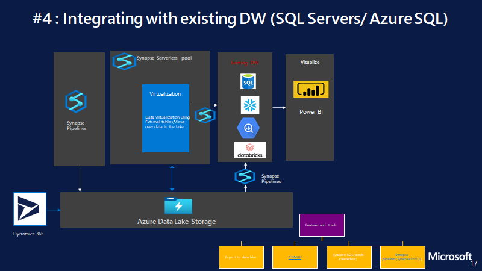
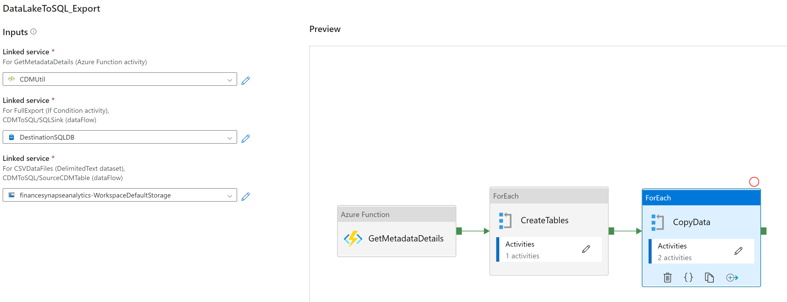

Dynamics 365 Finance and Operations Apps, [Export to data lake](https://docs.microsoft.com/en-us/dynamics365/fin-ops-core/dev-itpro/data-entities/finance-data-azure-data-lake) feature, lets you copy data and metadata from your Finance and Operations apps into your own data lake (Azure Data Lake Storage Gen2). 
Data that is stored in the data lake is organized in a folder structure in Common Data Model format, essentially data is stored in folders as headerless CSV and metadata as [Cdm manifest](https://docs.microsoft.com/en-us/common-data-model/cdm-manifest).  

With Dynamics 365 data in the lake, there are various architecture patterns that you can be utilized to build end to end BI and reporting and integration solution.
Following are some of the common architecture patterns including demo and solution template used in the demo to help you build POC.

# Table of Contents
* [1:Logical Data warehouse (virtualization) using Serverless pool](#logicaldw)
* [2:Cloud data warehouse using Synapse Dedicated pool](#clouddw)
* [3:Lakehouse architecture](#lakehouse)
  * [Approach 1 - Lakehouse using Synapse pipeline and Serverless pool](#lakehouse-synapse-pipeline)
  * [Approach 2 - Lakehouse using Databricks and PySpark](#lakehouse-databricks-pyspark)
* [4:Integrating with existing DW (SQL Servers/ Azure SQL)](#integrationdw)

# 1:Logical datawarehouse (virtualization) using Serverless pool

## Overview 
This pattern uses the Synapse serverless SQL pool to build logical data warehouse structure without moving the data out from lake. 
In this pattern the Dynamics 365 applications are moving the data in the lake and then you use serverless or lake database concept in Synapse to create the logical data model and then import the transformed data in the power BI. 

## Solution templates
1. [Use CDMUtil and configure to create External Table/Views on Serverless SQL Pool](../CDMUtilSolution/readme.md)
2. [Data model SQL View](DataVirtualization/LogicalDW_DataModelViews.sql) 
3. [Power Bi Report](DataVirtualization/GLReport_DataVirtualization.pbix) 

## Demo: Logical datawarehouse 
https://user-images.githubusercontent.com/65608469/165361941-dae756da-3d7e-453b-bfd8-2286b13f4715.mp4

# 2:Cloud data warehouse using Synapse Dedicated pool

## Overview 

This pattern uses cloud datawarehouse such as Synapse dedicated SQL pool. 
When using Synapse dedicated pool first you need to copy the data into dedicated pool. 
Most efficient way to load the data in the Synapse dedicated pool is by using [CopyInto statement](https://docs.microsoft.com/en-us/sql/t-sql/statements/copy-into-transact-sql?view=azure-sqldw-latest) 
as this process runs  on dedicated pool and load data directly from the lake. 

The pattern uses CDMUtil to create the dedicated pool table and collect data file location in the lake and store that in a control table. 
Then using Synapse pipeline we can read the control table and create dynamics copy into statements to copy the data into dedicated pool tables.
Once the table data is in dedicated pool, you can create data entities as views and build advanced transformation logic with stored procedure or sql script to create star schema model and populate final tables.

## Solution templates

1. [Copy Synapse Table](CloudDatawarehouse/CopySynapseTable.zip)
2. [GL Data Materialize](CloudDatawarehouse/GLDataMaterialize.zip)

## Demo 2
https://user-images.githubusercontent.com/65608469/165362039-4def15b4-42a9-4c58-bc74-491529b98e2c.mp4

# 3:Lakehouse architecture 

## Lakehouse architecture overview
This architecture pattern known as Lakehouse architecture is getting lots of popularity now a days. 
Fundamentally in this architecture raw, refined and curated data all live in data lake along with metadata and governance layer. 
Idea of this architecture is implementing similar data structures and data management features to those in a data warehouse, directly on the low-cost storage used for data lakes. 

There are a few key technology advancements that have enabled the data lakehouse
1. Metadata layers for data lakes 
2. Data format that provide ACID ( Atomicity, Consistency,  Isolation, Durability) property in data lake similar to relational databases
3. Query engine design to provide high-performance SQL execution on data lakes

Deltalake opensource data format developed by Databrick is leading data format used in the lakehouse architecture. 

In this architecture – 

**Bronze/Raw layer:** is the raw data from the source system that is available in the lake, without any transformation or cleaning. From Dynamics 365 perspective Export to data lake feature is exporting Tables data in the lake and this can be your raw zone. If you have other system, you can use Synapse pipeline/ADF to bring the data in the lake in the bronze layer. 

**Silver/ Refined:** next step in this process is silver or refined layer, in this layer data is still separated by source, however more refined, you can cleanse the data , convert into more optimal format like delta. You can do this cleansing process using streaming in micro batch mode. You can use Dynamics 365 near real time update change feed to incrementally process silver data layer.  

**Gold/Curated:** This is the final dimensional model, where you would be producing dimensional model by combining the data from various sources and producing the star schema model optimal for reporting. Data is again staged in the delta lake format and ready for reporting and BI workload.

https://user-images.githubusercontent.com/65608469/164785280-40e34bf8-20a2-406b-8350-6d169a48b3c6.mp4

## Approach 1 - Lakehouse using Synapse pipeline and Serverless pool

### Synapse pipeline templates

1. [SQL Script to get table metadata](Lakehouse/GetTablesMetadata.sql)
2. [1 SilverCDMtoDelta](Lakehouse/1_Silver_CDMToDeltaLake.zip)
3. [2 GoldDimTransform](Lakehouse/3_GoldTransformation_Dim.zip)
4. [3 GoldFactTransform](Lakehouse/3_GoldTransformation_Fact.zip)

### Demo 3
https://user-images.githubusercontent.com/65608469/164779488-7edd01ca-da41-4da3-9ff2-53bd7203d3dc.mp4

## Approach 2 - Lakehouse using Databricks and PySpark

### Code templates
1. [Commerce_clickstream_fake_data.py](Lakehouse/Commerce_clickstream_fake_data.py)
2. [Commerce_clickstream_pipeline_share.ipynb](Lakehouse/Commerce_clickstream_pipeline_share.ipynb)

### Demo 4
https://user-images.githubusercontent.com/104534330/165651095-1321eaf8-8b1e-42cb-bbe8-0f5d10cef119.mp4

# 4:Integrating with existing DW (SQL Servers/ Azure SQL)

## Overview 
There are scenarios where you may need to ingest Dynamics 365 Finance and Operations data available in the lake to relational database or external service – it can be Azure sql database, synapse dedicated pool or even on-premised sql database. 
This can be integration to existing datawarehosue solution or data integration or API scenarios where you expect millisecond response time response from sql server with targeted read.. **Export to data lake - Near real time data update feature (preview)** exports data incrementally in the changeFeed folder, it would be ideal if you could incrementally ingest this data to your sql database. 

Following are the two common architecture choices to achive the objective  

1. Use Synapse serverless ExternalTable/Views to virtualize the data in the lake and then use ETL tool to copy the data to destination database
2. Use ETL tool to directly read data from the data lake 

## Option 1: Using Synapse serverless Views
Bellow a generic Option 1 sample implementation with Synapse\ADF pipeline   

1. Export Finance and Operations Apps Tables data to Data Lake  
2. Create Synapse Workspace and use [CDMUtil](https://github.com/microsoft/Dynamics-365-FastTrack-Implementation-Assets/tree/master/Analytics/CDMUtilSolution) to create external table or view for Tables folder and ChangeFeed folders.
3. Download [FullExport_SQL](/Analytics/ArchitecturePatterns/SQLIntegration/FullExport_SQL.zip) and [IncrementalExport_SQL](/Analytics/SynapseToSQL_ADF/IncrementalExport_SQL.zip) templates to your local directory. 
4. Click **Import from Pipeline template** and locate downloaded template file from your local computer 
5. Select or create new Destination SQL Link Service (Destination SQL Server) and Source SQL Link Service (Synapse Serverless SQL Pool) and click Open pipeline and publish changes to workspace.
  
6. Repeat the steps for IncrementalExport_SQL template.
7. [IncrementalExport_SQL.zip](/Analytics/ArchitecturePatterns/SQLIntegration/IncrementalExport_SQL.zip) 

### Execute pipeline 
1. **FullExport_SQL** : Use this pipeline to trigger the full export for given tables provided as input parameter. You can also create scheduled trigger or event based trigger to start the pipeline when a new table is exported to data lake. 
2.  **IncrementalExport_SQL** : Use this pipeline to read views or external table created on top of ChangeFeed folder to incrementally load and merge data to destination table. You can run this for one table or run as schedule trigger to detect changed tables since last run to merge incremental changes. You can also trigger the pipeline based on the storage event of the ChangeFeed CSV files to immediately trigger the pipeline when a new CSV file is dropped in the ChangeFeed folder.
  
## Option 2: Directly reading data from data lake
If you are using Synapse/ADF pipelines as your ETL tool, [CDM Connector](https://docs.microsoft.com/en-us/azure/data-factory/format-common-data-model) can be used to directly read the data from data lake and sink to target database or service.   
For pro-code experiance such as Azure Spark or Azure Data bricks [CDM Connector]( https://github.com/Azure/spark-cdm-connector ) for Spark can be used to read the CDM format data from the lake.
If ETL tool of choice does not support CDM then you have to use custom metadata detection logic and schema drift support. This option can be cost effective compared to option 1 however the choice of the ETL tool and compute will be limited.  

Bellow is a generic sample implementation of reading CDM data directly from the lake using CDM connector and sink to Azure SQL database using Synapse\ADF pipeline 
1. Export Finance and Operations Apps Tables data to Data Lake
2. Deploy [CDM Util](https://github.com/microsoft/Dynamics-365-FastTrack-Implementation-Assets/blob/master/Analytics/CDMUtilSolution/deploycdmutil.md) as Function App - this is used to get metadata details directly from the lake 
3. **Download and Import Pipeline template** [CDMToSQL](SQLIntegration/CDMToSQL.zip) as Synapse pipeline

4. Change parameters and variables according to your setup

### Execute pipeline 

**DatalakeToSQL_Export** : Run the pipeline by changing parameters example *TableNames = CustTable,CustGroup* and *Incremental = false* to run the full export for given tables. For incremental export set the parameter *Incremental = true*. You can also create scheduled trigger or tumbling window trigger to run the incremental process. 

### Demo 5
https://user-images.githubusercontent.com/65608469/165363220-bc855e56-1579-42cf-b588-43ba02c7e5ca.mp4

