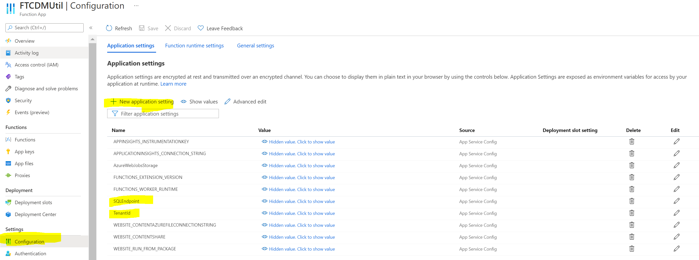

# Deploy CDMUtil as Function App 
To atomate reading and writing of CDM metadata, CDMUtil can be deployed as function App. Follow the steps bellow to deploy and configure

## Prerequisites
To deploy and use the CDMUtil solution to Azure, following pre-requisites are required
1. Azure subscription. You will require contributor access to an existing Azure subscription. If you don't have an Azure subscription, create a free Azure account before you begin.
2. Install Visual Studio 2019: to build and deploy C# solution as Azure function App (Download and .NET46 framework install https://dotnet.microsoft.com/download/dotnet-framework/thank-you/net462-developer-pack-offline-installer)
3. Create Synapse Analytics Workspace** [create synapse workspace](https://docs.microsoft.com/en-us/azure/synapse-analytics/quickstart-create-workspace) 

## Deployment steps
Deploy the CDMUtil solution as Azure function to automate end to end process of creating or updating metadata on Synapse Analytics. 
1. **Install Visual Studio 2019**: to build C# solution you need to Download and Install Visual Studio 2019 and .NET46 framework install https://dotnet.microsoft.com/download/dotnet-framework/thank-you/net462-developer-pack-offline-installer)
2.	Clone the repository [Dynamics-365-FastTrack-Implementation-Assets](https://github.com/microsoft/Dynamics-365-FastTrack-Implementation-Assets)

3. Open C# solution Microsoft.CommonDataModel.sln in Visual Studio 2019 and build
4.	Publish the CDMUtil_AzureFunctions Project as Azure function 
    1. Right-click on the project CDMUtil_AzureFunctions from Solution Explorer and select "Publish". 
    2. Select Azure as Target and selct Azure Function Apps ( Windows) 
    3. Click Create new Azure Function App and select subscription and resource group to create Azure function app 
    4. Click Publish 

## Configuration and access control 
### Enable MSI
1. Open Azure Portal and locate Azure Function App created.
2. ***Enable MSI*** go to Identity tab enable [System managed identity](/Analytics/EnableMSI.PNG) 

### Update configuration 
1. In Azure portal, function app click on configuration and add following new application settings  a

| Name           |Description |Example Value  |
| ----------------- |:---|:--------------|
|TenantId          |Azure active directory tenant Id |979fd422-22c4-4a36-bea6-xxxxx|
|SQLEndPoint    |Synapse SQL Pool endpoint connection string. If Database name is not specified - create new database, if userid and password are not specified - MSI authentication will be used.   |Server=ftd365synapseanalytics-ondemand.sql.azuresynapse.net; 



2. (Optional) additional optional configuration that can be provided to overide the default values can be found under CDMUTIL parameters details section bellow   

### Grant access control 
#### Storage account 
To Read and Write CDM metadata to storage account, function app must have Blob Data Reader and Blob Data Contributor access.
1. In Azure portal, go to Storage account and grant Blob Data Contributor and Blob Data Reader access to current user 
2. In case solution is Deployed as Azure Function Apps, you must enable ***System managed identity*** and grant MSI app Blob Data Contributor and Blob Data Reader access 


#### Synapse Analytics 
To execute DDL statement on synapse analytics, you can either use sql user authentication or MSI authentication. To use MSI authentical, connect to Synapse Analytics and run following script 
```SQL
-- MSI user can only be added when you are connected to Synapse SQL Pool Endpoint using AAD login 

--Option 1: Grant MSI Server level access on Synapse Analytics SQL Pool 
CREATE LOGIN YourFunctionAppName FROM EXTERNAL PROVIDER;
ALTER SERVER ROLE  sysadmin  ADD MEMBER [YourFunctionAppName];

--Option 2 :Grant MSI DB level access on Synapse Analytics SQL Pool. 
--If you grant DB level access then you must create DB and specify Databasename in the FunctionApp configuration  
use YourDBName
Create user [YourFunctionAppName] FROM EXTERNAL PROVIDER;
alter role db_owner Add member [YourFunctionAppName]
```
