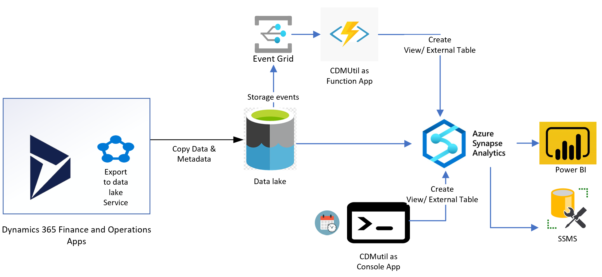
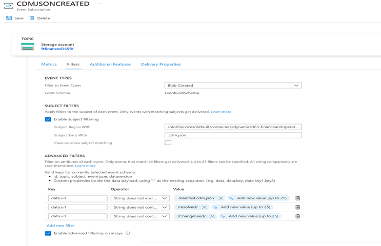
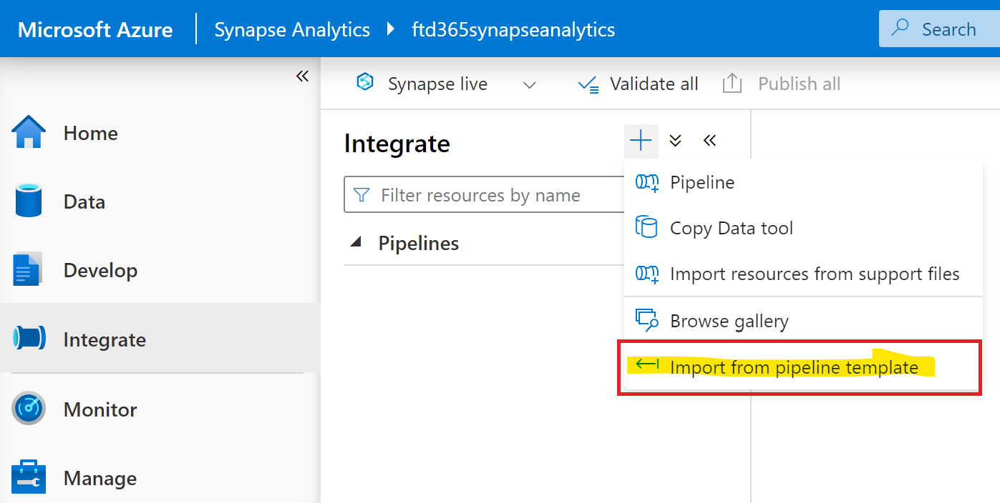

# Overview 
In Dynamics 365 Finance and Operations Apps, [Export to data lake](https://docs.microsoft.com/en-us/dynamics365/fin-ops-core/dev-itpro/data-entities/finance-data-azure-data-lake) feature, lets you copy data and metadata from your Finance and Operations apps into your own data lake (Azure Data Lake Storage Gen2). 
Data that is stored in the data lake is organized in a folder structure that uses Common Data Model format. 
Export to data lake feature, export data as headerless CSV and metadata as [Cdm manifest](https://docs.microsoft.com/en-us/common-data-model/cdm-manifest).  

Many Microsoft and third party tools such as Power Query, Azure Data Factory, Synapse Pipeline supports reading and writing CDM, 
however the data model from OLTP systems such as Finance Operations is highly normalized and hence must be transformed and optimized for BI and Analytical workload. 
[Synapse Analytics](https://docs.microsoft.com/en-us/azure/synapse-analytics/overview-what-is) brings together the best of **SQL**, **Spark** technologies to work with your data in the data lake, provides **Pipelines** for data integration and ETL/ELT, and deep integration with other Azure services such as Power BI. 

Using Synapse Analytics Dynamics 365 customers can un-lock following scenarios 

1. Data exploration and ad-hoc reporting using T-SQL 
2. Logical datawarehouse using lakehouse architecture 
3. Replace BYOD with Synapse Analytics
4. Data transfromation and ETL/ELT using Pipelines, T-SQL and Spark
5. Enterprise Datawarehousing
6. System integration using T-SQL

To get started with Synapse Analytics with data in the lake, you can use CDMUtil to convert CDM metadata in the lake to Synapse Analytics metadata. CDMUtil is a client tool based on [CDM SDK](https://github.com/microsoft/CDM/tree/master/objectModel/CSharp) to read [Common Data Model](https://docs.microsoft.com/en-us/common-data-model/) metadata and convert into metadata for Synapse Analytics SQL pools and Spark pools. 

Following diagram shows high level concept about the use of Synapse Analytics- 



### Prerequisites 

Following are pre-reqsuisites before you can use CDMUtil 

1. [Install Export to data lake add-in for Finance and Operations Apps](https://docs.microsoft.com/en-us/dynamics365/fin-ops-core/dev-itpro/data-entities/configure-export-data-lake).
2. [Create Synapse Analytics Workspace](https://docs.microsoft.com/en-us/azure/synapse-analytics/quickstart-create-workspace). 
3. [Grant Synapse Analytics Workspace managed identify, Blob data contributor access to data lake](https://docs.microsoft.com/en-us/azure/synapse-analytics/security/how-to-grant-workspace-managed-identity-permissions#grant-permissions-to-managed-identity-after-workspace-creation)

# Deploying CDMUTIL

As shown in the previous diagram, CDMUtil can be deployed as [**Azure Function**](https://docs.microsoft.com/en-us/azure/azure-functions/functions-overview) or **Console application** to execute manually. 

## 1. Azure Function with integrated storage events (EventGrid) 
CDMUtil can be deployed as Azure Function to convert CDM metadata to Synapse Analytics metadata. 

1. [Deploy CDMUtil as Azure Function](deploycdmutil.md) as per the instruction.
2. In Azure portal, go to storage account, click on Events > + Event Subscription to create a new event subscription
3. Give a name and select Azure Function App eventGrid_CDMToSynapseView as endpoint.

4. Click on Filters and update event filters as following 
  a.  Enable subject filters
  * **Subject begin with**: /blobServices/default/containers/dynamics365-financeandoperations/blobs/***environment***.sandbox.operations.dynamics.com/Tables
  * **Subject ends with**: .cdm.json
  b. Advance filters
  * **Key**: data.url **Operator**:string does not ends with **Value**:.manifest.cdm.json 
  * **Key**: data.url **Operator**:string does not contain **Value**:/resolved/
  * **Key**: data.url **Operator**:string does not contain **Value**:/ChangeFeed/
  


## 2. CDMUtil Console App 
To run CDMUtil from local desktop, you can download and run CDMUtil executable using Command prompt or Powershell. 

1. Download the Console Application executables [CDMUtilConsoleApp.zip](/Analytics/CDMUtilSolution/CDMUtilConsoleApp.zip)
2. Extract the zip file and extract to local folder 
3. Open CDMUtil_ConsoleApp.dll.config file and update the parameters as per your setup

```XML
<?xml version="1.0" encoding="utf-8" ?>
<configuration>
  <appSettings>
   <add key="TenantId" value="00000000-86f1-41af-91ab-0000000" />
    <add key="AccessKey" value="YourStorageAccountAccessKey" />
    <add key="ManifestURL" value="https://youradls.blob.core.windows.net/dynamics365-financeandoperations/yourenvvi.sandbox.operations.dynamics.com/Tables/Tables.manifest.cdm.json" />
    <add key="TargetDbConnectionString" value="Server=yoursynapseworkspace-ondemand.sql.azuresynapse.net;Initial Catalog=dbname;Authentication='Active Directory Integrated'" />
    <!--add key="TargetSparkConnection" value="https://yoursynapseworkspace.dev.azuresynapse.net@synapsePool@dbname" /-->
    <!--Parameters bellow are optional overide parameters/-->
    <!--add key="DataSourceName" value="d365folabanalytics_analytics" />
    <add key="DDLType" value="SynapseView" />
    <add key="Schema" value="dbo" />
    <add key="FileFormat" value="CSV" />
    <add key="ParserVersion" value="2.0" />
    <add key="DefaultStringLength" value ="100"/>
    <add key="TranslateEnum" value ="false"/>
    <add key="TableNames" value =""/>
    <add key="ProcessEntities" value ="true"/>
    <add key="CreateStats" value ="false"/>
    <add key="ProcessSubTableSuperTables" value ="true"/>
    <add key="AXDBConnectionString" value ="Server=DBServer;Database=AXDB;Uid=youruser;Pwd=yourpassword"/>
    <add key="ServicePrincipalBasedAuthentication" value ="false"/>
    <add key="ServicePrincipalAppId" value ="YourAppId - You can use the same app id, which you´ve used for installing the LCS Add-In"/>
    <add key="ServicePrincipalSecret" value ="YourSecret - Corresponding Secret"/-->
  </appSettings>
</configuration>
```

4. Run CDMUtil_ConsoleApp.exe and monitor the result 

# How it works  

Bellow is how CDMUtil works end-to-end with Export to data lake feature

1. Using Finance and Operations App, [Configure Tables in Finance and Operations App](https://docs.microsoft.com/en-us/dynamics365/fin-ops-core/dev-itpro/data-entities/finance-data-azure-data-lake)) service. 
2. Data and CDM metadata (Cdm.json) gets created in data lake 
3. *When Azure Function is configured* blob storage events is generated and triggers *Azure Function* automatically with blob URI as *ManifestURL*. 
4. *When running Console App* configurations are retrived from CDMUtil_ConsoleApp.dll.config file. 
5. CDMUtil retrieve storage account URL from *ManifestURL* and connect with *AccessKey*, if access key is not provided, current user/app(MSI) credential are used (current user/application must have *Blob data reader* access to storage account).
6. CDMutil recursively reads manifest.cdm.json and identify entities, schema and data location, convert metadata as TSQL DDL statement as per *DDLType{default:SynapseView}*.
7. Connect to Synapse Analytics SQL Pool using *TargetDbConnectionString*  or SparkPool endpoints *TargetSparkConnection*. Current user/App(MSI) credentials are used when sql authentication is not available.
8. Create and prepare Synapse Analytics database, [for reference read](https://docs.microsoft.com/en-us/azure/synapse-analytics/sql/tutorial-logical-data-warehouse).
9. Execute SQL DDL to create [Views over external data](https://docs.microsoft.com/en-us/azure/synapse-analytics/sql/create-use-views#views-over-external-data), [Extenral tables](https://docs.microsoft.com/en-us/azure/synapse-analytics/sql/create-use-external-tables#external-table-on-a-file) or [prepare Synapse Tables for loading](https://docs.microsoft.com/en-us/azure/synapse-analytics/sql-data-warehouse/design-elt-data-loading#3-prepare-the-data-for-loading) 
10. To learn about how Synapse Analytics enables querying CSV files [refere synapse documentation](https://docs.microsoft.com/en-us/azure/synapse-analytics/sql/query-single-csv-file).  

Once view or external tables are created, you can [connect to Synapse Analytics pools](https://docs.microsoft.com/en-us/azure/synapse-analytics/sql/connect-overview) to query and transform data using TSQL.

# CDMUtil common use cases 

Following are common use cases to use CDMutil with various configuration options.

## 1. Create tables as Views or External table on Synapse SQL serverless pool
Follow the steps bellow to create views or external table on Synapse SQL Serverless pool

1. Using Finance and Operations App [Configure Tables in Finance and Operations App](https://docs.microsoft.com/en-us/dynamics365/fin-ops-core/dev-itpro/data-entities/finance-data-azure-data-lake) service. 
2. Validate that data and CDM metadata (cdm.json) gets created in data lake 
3. Update following configurations in CDMUtil_ConsoleApp.dll.config or Function App configurations (**Mandatory**, *Optional*)

* **TenantId**: Azure AAD Tenant ID
* *AccessKey*: Storage account access key. Current user/app access to storage account is used if not provided
* **ManifestURL**: URI of the root manifest or leaf level manifest.json or cdm.json.|[path]/Tables.manifest.cdm.json,[path]/[TableName].cdm.json 
* **TargetDbConnectionString**: Synapse SQL Serverless connection string. 
* *DDLType*: *SynapseView* or SynapseExternalTable
* *Schema*: *dbo* 
* *ParserVersion*: 1.0 or *2.0* 
* *AXDBConnectionString*: AXDB ConnectionString to column string lengh if not present in the cdm metadata 

4. Run CDMUtil_ConsoleApp.exe using Command promt or Powershell and monitor result
5. CDMutil recursively reads, convert metadata as TSQL DDL statement and execute as per *DDLType{default:SynapseView}*.  
6. If new Tables are added or existing tables metadata is modified in the lake, run the CDMUtil again to create or update metadata in Synapse.  
7. When using Azure function, function will automatically trigger when cdm.json files are created or update in the data lake.
8. Once view or external tables are created, you can [connect to Synapse Analytics pools](https://docs.microsoft.com/en-us/azure/synapse-analytics/sql/connect-overview) to query and transform data using TSQL.
9. If you want to also create external table or view for Tables data under ChangeFeed, you can change the ManifestURL to ChangeFeed.manifest.cdm.json and change the schema and run the CDMUtil console app or call function App with HTTP trigger. 

### DDLType & ParserVersion for Tables
When using Synapse Analytics serverless pool to create logical datawarehouse, there are currently 2 supported objects which can be persisted to database, External Tables and Views. 
While both object type provides ability to query data from lake using TSQL, there are few functional and securtiy differences between external table and views, Following few blog post describing the difference 
1. https://www.serverlesssql.com/optimisation/external-tables-vs-views-which-to-use/
2. https://www.jamesserra.com/archive/2020/11/external-tables-vs-t-sql-views-on-files-in-a-data-lake/
3. https://www.linkedin.com/pulse/demystifying-synapse-serverless-sql-openrowset-external-atoui-wahid/
 
In addition to Object type, there are CSV parser (1.0 and 2.0) that are supported.CSV parser version 1.0 feature rich while parser version 2.0 is built for performance.  
For Dynamics 365 F&O use case, in general Parser verion 2 is prefered for performance reason however some out of the box data entities may have compatibility issue. Review following options  

|Option                                           |Description                                                             |
|-------------------------------------------------|:------------------------------------------------------------------|
|DDTType= SynapseExternalTable, ParserVersion =1.0|Feature reach, supports datetime and USE_TYPE_DEFAULT = true with this option serverless pool returns default sql values for example example null string is represented as emptystring. If you plan to create Entities as view then this options should provide you best compatibility |  
|DDTType= SynapseView, ParserVersion =1.0         |Supports datetime however USE_TYPE_DEFAULT is not supported that may cause some compatibility issue with entities views |  
|DDTType= SynapseExternalTable, ParserVersion =2.0|Parser version 2 provides better performance however USE_TYPE_DEFAULT is not supported and for datetime only datetime2 format is supported. This may cause compatibility issue with data entities views join conditions  |
|DDTType= SynapseView, ParserVersion =2.0         |Parser version 2 provides better performance however USE_TYPE_DEFAULT is not supported and for datetime only datetime2 format is supported. This may cause compatibility issue with data entities views join conditions  |

#### Common error and resolutions 
|Error           | Description |Resolution |
|----------------- |:---|:--------------|
|**Error to read cdm files from data lake**|Error reading cdm.json files|Provide Storage account AccessKey or grant current user/MSI must have blob data reader access to storage account|
|**Error when creating view or external table**|Content of directory on path '.../TableName/*.csv' cannot be listed.|Grant synapse workspace blob data contributor or blob data reader access to storage account|
|**Error when querying the view or external table** |Error handling external file: 'Max errors count reached.'. File/External table name: '.../{TableName}/{filename}.csv'.| Usually the error is due to datatype mismatch ie column lenght for string column. If your environment does not have Enhanced metadata feature on, try following options Option 1: add config <add key="DefaultStringLength" value ="1000"/> to increase the defaultStringLength. Potential perf impact when using serverless Option 2: Add specific Table.Field in the Manifest/SourceColumnProperties.json - CDMutil will override the column length for given table.field Option 3: Provide AXDBConnectionString to read the column length from AXDB while creating the view


## 2. Create F&O Data entities as View on Synapse SQL pool
Dynamics 365 Finance and Operations **Data entities** provides conceptual abstraction and encapsulation (de-normalized view) of underlying table schemas to represent key data concepts and functionalities. 
Existing Finance and Operations customer that are using BYOD for reporting and BI scenarios, may wants to create Data entities as view on Synapse to enable easier transition from BYOD to Export to data lake and minimize changes in existing reports and ETL processes. 
Export to data lake **Select tables using entities** option enables users to export dependent tables and data entity view defintion as cdm file under Entities folder in the data lake. 

1. To create data entities as view on Synapse,in addition to above configurations, update following configurations  

* **ProcessEntities**: Process entities list from file Manifest/EntityList.json, this option can be used even if you dont have the entity metadata in the data lake.. 
* **Manifest/EntityList.json**: List of the entities, Key name of entity, Value = Entity view definition. Leave value ="" to retrieve view definition from AXDBConnectionString. 
* **AXDBConnectionString**: AXDB ConnectionString to retrive dependent views definition for Data entities.
* **Manifest/EntityList.json**: List of the entities, Key name of entity, Value = Entity view definition. Leave value ="" to retrieve view definition from AXDBConnectionString. 
* *SQL/ReplaceViewSyntax.json*: Parse the T-SQL syntax of entity and replaces with known supported syntax in Synapse Analytics.
* *CreateStats*: Retrives column used in the join and create statistics in Synapse Serverlsess to improve join query performance. In Synapse Analytics automatic stats for CSV is planned to supported in future.
2. Run CDMUtil console App or trigger Function App using HTTP to create entities as views on Synapse.
3. If you recieve error for missing tables, add those table to Export to data lake service, wait for the metadata to land in the lake and run the CDMUtil again.

#### Create F&O Sub Tables as View on Synapse Serverless
Using CDMUtil you can also create F&O SubTables such as CompanyInfo DirPerson etc as view on base table. 
1. To create sub tables as view on Synapse,in addition to above configurations, update following configurations 
* **ProcessSubTableSuperTables**: Process sub table list from file Manifest/SubTableSuperTableList.json 
* **Manifest/SubTableSuperTableList.json**: Key name of sub Table, Value = Base table name. 
* **AXDBConnectionString**: AXDB ConnectionString to retrive the views definition of sub Table.
2. Run CDMUtil console App

### Common issues and workarounds 

|Issue           |Description |Workaround/Recomendation |
|----------------- |:---|:--------------|
|**Missing dependent tables** |Data entities view creation may fail if all dependent tables are not already available in Synapse SQL pool. Currently when **Select tables using entities** is used, all dependent tables does not get added to lake. | To easily identify missing tables provide AXDBConnectionString, CDMUtil will list outs missing tables in Synapse. Add missing table to service and run CDMUtil again |
|**Missing dependent views**|Data entities may have dependency on F&O views, currently metadata service does not produce metadata for views.| AXDBConnectionString of source AXDB tier1 to tier2 environment and automatically retrieve dependent views and create before create entity views.|
|**Syntax dependecy**|Some data entities or views may have sql syntax that is not supported in synapse.| CDMUtil parse the sql syntax and replaces with known supported syntax in Synapse SQL. ReplaceViewSyntax.json contains list of known syntax replacements. Additional replacement can be added in the file if required. |
|**Performance issue when querying complex views** |You may run into performance issue when querying the complex view such that have lots of joins and complexity| Try creating stats by using option createStats = true . Query the columns that are only needed. Simplify the view definition of the entity. |
|**Case sensitive object name** |Object name can be case sensitive in Synapse SQL pool and cause error while creating the view definition of entities | Change your database collation to 'alter database DBNAME COLLATE Latin1_General_100_CI_AI_SC_UTF8' |

You can also identify views and dependencies by connecting to database of Finance and Operations Cloud hosted environment or sandbox environment using sql query bellow


## 3. Copy data to Synapse Table in dedicated pool (DW GEN2)

If plan to use Synapse dedicated pool (Gen 2) and want to copy the Tables data from data lake to Gen2 tables using Copy activity.   
You can use CDMUtil with DDLType = SynapseTable to collect metadata and insert details in control table to further automate the copy activity using synapse pipeline. 

#### Create metadata and control table

Follow the steps bellow to create metadata and control table
1. Update following configuration
* **TargetDbConnectionString**: Synapse SQL Dedicated pool connection string. 
* **DDLType**: SynapseTable
2. CDMUtil will create control table and stored procedures. It will also create empty tables and populate data in control table based on the CDM metadata.For details check this sql script ()
3. CDMUtil will also create data entities as view definition Synapse dedicated pool if entity parameters are provided.

Data need to be copied in the dedicated pool before it can be queried. Bellow is example process to copy the data to dedicated pool.

#### Copy data in Synapse Tables
1. To copy data in Synapse tables ADF or Synapse pilelines can be used. 
2. Download [CopySynapseTable template](/Analytics/CDMUtilSolution/CopySynapseTable.zip)    
3. Import Synapsepipeline Template 
4. Provide parameters and execute CopySynapseTable pipeline to copy data to Synapse tables 

## 4. Create External Tables in Synapse Lake Database using SparkPool
You can also use CDMUtil to create External Tables in Synapse [Lake database](https://docs.microsoft.com/en-us/azure/synapse-analytics/database-designer/concepts-lake-database). 

1. [Create a Apache Spark Pool](https://docs.microsoft.com/en-us/azure/synapse-analytics/quickstart-create-apache-spark-pool-portal)
2. Create a [lake database](https://docs.microsoft.com/en-us/azure/synapse-analytics/database-designer/create-empty-lake-database)
3. Update CDMUtil configuration *TargetSparkConnection* to provide Spark Pool connection information.  
4. Run the CDMUtil console app or function App to create external tables in Lake database
5. External tables created in Lake database are [automatically share metadata](https://docs.microsoft.com/en-us/azure/synapse-analytics/metadata/table) to serverless SQL pool.

# Additional References

## CDMUTIL parameters details 

|Required/Optional| Name           |Description |Example Value  |
|--| ----------------- |:---|:--------------|
|R|TenantId          |Azure active directory tenant Id |979fd422-22c4-4a36-bea6-xxxxx|
|R|SQLEndPoint/TargetDbConnectionString    |Synapse SQL Pool endpoint connection string. If Database name is not specified - create new database, if userid and password are not specified - MSI authentication will be used.   |Server=yoursynapseworkspace-ondemand.sql.azuresynapse.net; 
|R|ManifestURL    |URI of the sub manifest or leaf level manifest.json or cdm.json. When using EventGrid trigger with function app, uri is retrived from event | https://youradls.blob.core.windows.net/dynamics365-financeandoperations/yourenvvi.sandbox.operations.dynamics.com/Tables/Tables.manifest.cdm.json, https://youradls.blob.core.windows.net/dynamics365-financeandoperations/yourenvvi.sandbox.operations.dynamics.com/Entities/Entities.manifest.cdm.json 
|O|AccessKey    |Storage account access key.Only needed if current user does not have access to storage account |  
|O|TargetSparkConnection    |when provided CDMUtil will create lake database that can be used with Spark as well as SQL Pool | https://yoursynapseworkspace.dev.azuresynapse.net@synapsePool@dbname
|O|DDLType          |Synapse DDLType default:SynapseView  |<ul><li>SynapseView:Synapse views using openrowset</li><li>SynapseExternalTable:Synapse external table</li><li>SynapseTable:Synapse permanent table(Refer section)</li></ul>|
|O|DefaultStringLength|default = 100, default string length|100|
|O|Schema    |schema name default:dbo | dbo, cdc 
|O|DataSourceName    |external data source name. new external ds is created if not provided | 
|O|FileFormat    |external file format - default csv file format is created if not provided |
|O|ParserVersion    |default = 2.0 and recomended for perf | 
|O|TranslateEnum    |default= false |   
|O|ProcessEntities    |Extract list of entities for EntityList.json file to create view on Synapse SQL Pool| default= false
|O|CreateStats    | Extract Tables and Columns names from joins and create stats on synapse| default= false
|O|TableNames    |limit list of tables to create view when manifestURL is root level |
|O|AXDBConnectionString    |AXDB ConnectionString to retrive dependent views definition for Data entities  |


 
