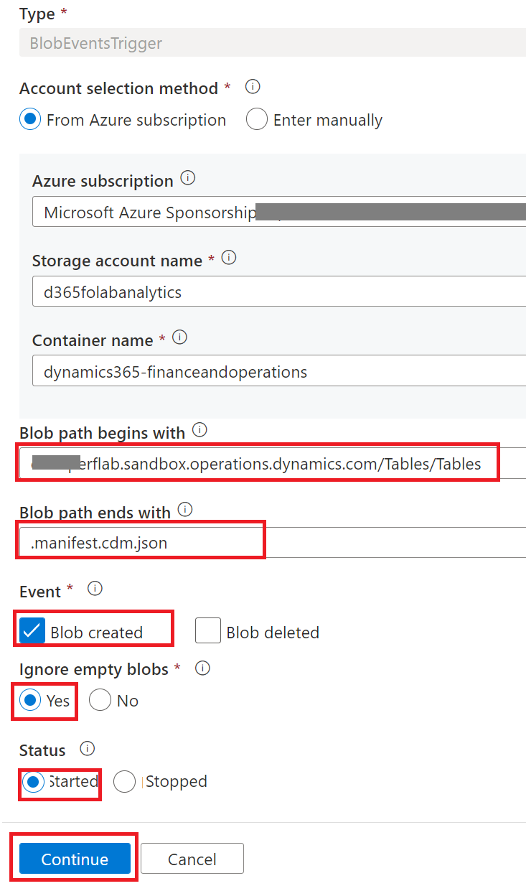
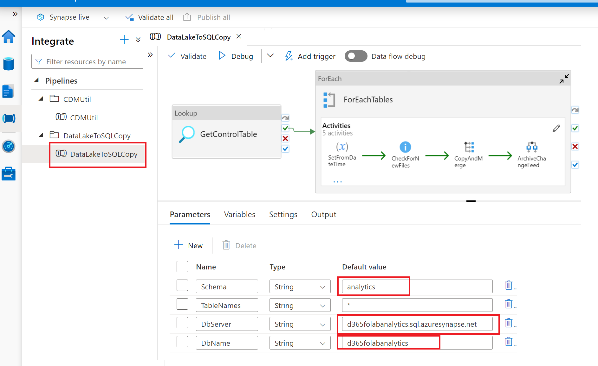

**Overview**

In Dynamics 365 Finance and Operations Apps, [Export to data lake](https://docs.microsoft.com/en-us/dynamics365/fin-ops-core/dev-itpro/data-entities/finance-data-azure-data-lake) feature, lets you copy data and metadata from your Finance and Operations apps into your own data lake (Azure Data Lake Storage Gen2). 
Data that is stored in the data lake is organized in a folder structure that uses Common Data Model format. 
Export to data lake feature, export data as headerless CSV and metadata as [Cdm manifest](https://docs.microsoft.com/en-us/common-data-model/cdm-manifest).  

To get started with Synapse Analytics with data in the lake, you can use CDMUtil pipeline to convert CDM metadata in the lake to **Synapse Analytics** or **SQL metadata**. 
CDMUtil is a Synapse/ADF pipeline that reads [Common Data Model](https://docs.microsoft.com/en-us/common-data-model/) metadata and convert and execute  **Synapse Analytics SQL pools** or **SQL Server** DDL statements. 

Following diagram shows high level concept about the use of Synapse Analytics- 


**Note**: We also have [CDMUtil as Azure Function or Console App](readme.md), this utility is developed in C# and utilizes the CDM SDK to read the CDM metadata and create Synapse metadata. 
Unlike CDMUtil as Azure function and console App, CDMUtil pipeline, reads the json files directly and uses TSQL scripts to create the DDL statement required for Synapse Analytics.
Since CDUtil is just a pipeline within the Synapse or Azure Data Factory, this approach simplify the deployment and maitainance of the utilities.

             

**Pre-requisites**
1. Dynamics 365 Finance and Operations [Export to data lake feature](https://docs.microsoft.com/en-us/dynamics365/fin-ops-core/dev-itpro/data-entities/configure-export-data-lake) is configured with [*Enhanced metadata feature*](https://docs.microsoft.com/en-us/dynamics365/fin-ops-core/dev-itpro/data-entities/azure-data-lake-enhanced-metadata#enhanced-metadata-preview).
2. [Create Synapse Analytics Workspace](https://docs.microsoft.com/en-us/azure/synapse-analytics/quickstart-create-workspace). 
3. [Grant Synapse Analytics Workspace managed identify, Blob data contributor access to data lake](https://docs.microsoft.com/en-us/azure/synapse-analytics/security/how-to-grant-workspace-managed-identity-permissions#grant-permissions-to-managed-identity-after-workspace-creation)

***Serverless sql pool*** 
1. Create serverless database 
Use the following query, changing mydbname to a name of your choice
```SQL
CREATE DATABASE mydbname
```
2. Create a master key encryption on the database 
```SQL
-- create master key that will protect the credentials:
CREATE MASTER KEY ENCRYPTION BY PASSWORD = <enter very strong password here>
```
***Dedicated sql pool (optional)*** 
Create a Dedicated SQL pool if not already exists

Note: You do not have to create Dedicated SQL pool to deploy the pipeline if you do not plan to use dedicated SQL pool.

**Deploy CDMUtil pipeline**

1. Download [CDMUtil pipeline template(CDMUtilPipeline.zip)](/Analytics/CDMUtilSolution/CDMUtilPipeline.zip) to local computer    
2. Open Synapse Analytics Workspace, select Integrate, Click + to Import Synapse pipeline Template 
3. Locate **CDMUtilPipeline.zip** from the local computer and select **Open**


4. ***Creating Linked Services***

Before you can import the pipeline template, you must create a linked service to link your data store to the Synapse Workspace. 
Linked services are much like connection strings, which define the connection information needed for the service to connect to external resources.
CDMUtil pipeline requires following linked services 

|LinkedService       | Type        |Purpose                                  |
|--------------------|:------------|:----------------------------------------|
|AXDBConnection      |Azure SQL Database |To connect to Dynamics 365 F&O Tier1 or Tier 2 database and retrieve dependencies |
|Target Database     |Azure SQL Database |Target database to create the objects- Synapse serverless, Synapse Dedicated pool or SQL Server|
|Source storage      |Azure Storage Gen 2|Storage account that is configured with export to data lake|

4.1. **Create *AXDB connection* linked service:** You must create a linked service to import the pipeline template, however retriving dependencies from AXDB is optional, if you do not have requirement to complex data entities views, you may just create a dummy linked service to complete the pipeline import

  

4.2. **Create *Target Database* linked service:** Create **Azure SQL Database** linked service to connect target database and create database objects. 

a. Enter a **Name** for linked service
b. Create parameters **ServerName** and **DBName** 
c. On account selection method, select **Enter manually** 
d. **Fully qualified domain name*** click add dynamic content and then select **ServerName** parameter
e. **Database name** click add dynamics content and select **DbName** from parameter
f. **Authentication type** select **System Assigned Managed Identity**
g. Click **Create** to create the linked service. 


4.3. **Create **Source storage** linked service:** Create **Azure Storage Account Gen 2** linked service to connect source datalake and read cdm metadata.

a. Enter a **Name** for linked service
b. Create parameters **StorageAccount**  
c. On account selection method, select **Enter manually** 
d. **URL*** click add dynamic content and then select **StorageAccount** parameter
e. **Authentication type** select **System Assigned Managed Identity**
f. Click **Create** to create the linked service.


5. Select **linked services** and click **Open pipeline**


6.Update **parameters** and click **Publish all** to deploy the pipeline 

|Parameters                  |Value                                                                 |
|----------------------------|:---------------------------------------------------------            |
|StorageAccount              |https://*yourStorageAccountName*.dfs.core.windows.net/    |
|container                   |dynamics365-financeandoperations                          |
|Environment                 |*YourEnvironment.sandbox*.operations.dynamics.com       |
|DDLType                     |SynapseView/SynapseExternalTable/SynapseTable/SQLTable    |
|ParserVersion               |1.0 or 2.0                                                |
|DbServer                    |Fully qualified DB server name for example - *SynapseWorkspaceName*-ondemand.sql.azuresynapse.net **or** SynapseWorkspaceName.sql.azuresynapse.net **or** *AzureSQLDB*.database.windows.net|
|DbName                      |*DatabaseName*                       |
|Schema                      |Schema name (Schema must exist in the database, you must use dbo schema if plan to create entities as views)|
|ObjectTypes                 |Tables,Entities,ChangeFeed (Comma seperated values to filter object type)       |
|GetDependency               |False/True - If true then connect to AXDB retrieve dependency |
|EntityListForDependency     |Comma seperated list of entities or views to retrieve dependency|

   


**Execute CDMUtil pipeline** 

***On-demand run***

1. Click on Integrate and then click **CDMUtil** to open pipeline
2. Click on **Debug**
3. Change pipeline run parameter or use default values and click **ok **
4. Pipeline will run and you can monitor the execution **Output**    


***Add schedule or storage events***

Setup trigger to automated CDMUtil pipeline execution. 

1. Create a new trigger , select **type** - you can use **schedule** trigger to run pipeline on schedule time or use **storage event** trigger when metadata change.

2. **For Schedule trigger**: 
    2.1 Select **Start date**, **Time zone** and **Recurrence** as appropriate.

3. **For Storage events**:

    3.1. Select **Storage account name**,  **Container**, **Blob path begins with**:yourenvironmentfolder.operations.dynamics.com/Tables/Tables and **Blob path ends with**:.manifest.cdm.json,**Event**: Blob created, **Ignore empty blobs**: Yes 

    

   3.2 Click next, for Data preview, This screen shows the existing blobs matched by your storage event trigger configuration. Click next

4. On the **Trigger Run Parameters** - override parameters or leave it blank and click next - pipeline default parameters are used when parameters are not provided on trigger. 
5. Create and publish the changes to deploy the trigger. 

        Note: This pipeline template can be deployed and executed on Azure Data Factory following  similar steps.

**DataLake To SQL - Incremental data copy pipeline**

Single pipeline to copy full and incremental data from datalake to Synapse dedicated pool or Azure SQL database native tables 

1. Download [Datalake to SQL Copy(DataLakeToSQLCopy.zip)](/Analytics/CDMUtilSolution/DataLakeToSQLCopy.zip) to local computer   
2. Click **Import from pipeline template** open DataLakeToSQLCopy.zip file, select linked services for source data lake and target database connection 


3. Update parameters and execute DataLakeToSQLCopy pipeline to copy data to Synapse or SQL tables 

