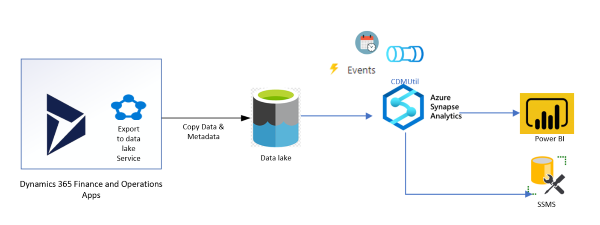
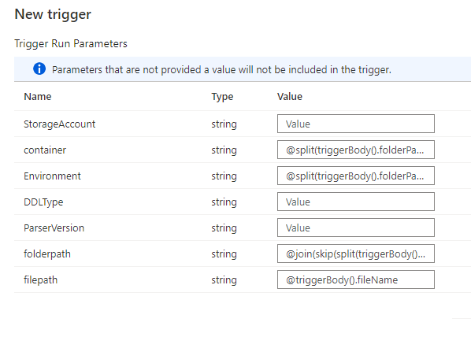

# Overview

Analytics for Dynamics 365 finance and operation apps requires few building blocks, that when connected together can enable your organization to build an Analytical and Integration solution. You take your data to your Data Lake and from there to Synapse data warehouse. You create what we call a modern data warehouse. This will also let you replace your BYOD entities, which have their challenges. 
	
The main building blocks are [Export to data lake service](https://learn.microsoft.com/en-us/dynamics365/fin-ops-core/dev-itpro/data-entities/azure-data-lake-ga-version-overview), CDMUtil solution, [Azure Data Lake](https://learn.microsoft.com/en-us/azure/storage/blobs/data-lake-storage-introduction) and [Azure Synapse Analytics](https://learn.microsoft.com/en-us/azure/synapse-analytics/overview-what-is).

Using above building blocks, an organization can come up with the right architecture for their analytical requirements. In below post, we will step through instructions on how you can setup a working solution using one of the above patterns. The templates used are provided as links. 

The following diagram conceptualizes high level architecture: 



# Foundational concepts

1. Export to data lake - This feature lets you copy data and metadata from your Finance and Operations apps into your own data lake (Azure Data Lake Storage Gen2). 
Data that is stored in the data lake is organized in a folder structure that uses the Common Data Model format. 
Export to data lake feature exports data as headerless CSV files and metadata as [Cdm manifest](https://docs.microsoft.com/en-us/common-data-model/cdm-manifest). 

2. CDMUtil - converts CDM metadata in the lake to **Synapse Analytics** or **SQL metadata**. CDMUtil is a Synapse/ADF pipeline that reads [Common Data Model](https://docs.microsoft.com/en-us/common-data-model/) metadata and converts and executes  **Synapse Analytics SQL pools** or **SQL Server** DDL statements. **Note**: We also have [CDMUtil as an Azure Function or Console App](readme.md). This utility is developed in C# and utilizes the CDM SDK to read the CDM metadata and create Synapse metadata. Unlike CDMUtil as an Azure function and console App, the CDMUtil pipeline reads the json files directly and uses TSQL scripts to create the DDL statements required for Synapse Analytics. Since CDMUtil is just a pipeline within Synapse or Azure Data Factory, this approach simplifies the deployment and maintenance of the utilities.


3. Azure Data Lake - Data lake is a blob storage repository in the cloud. It can save any kind of object since it stores it as a blob. It is a popular form of cloud storage as is much cheaper compared to relational databases.

4. Azure Synapse Analytics - Synapse brings together the best of **SQL** and **Spark** technologies to work with your data in the data lake, provides **Pipelines** for data integration and ETL/ELT, and facilitates deep integration with other Azure services such as Power BI. 

5. Serverless pool - This is the most innovative design. In this database, you don’t actually move data at all. Data sits in a data lake, on top of that we create a logical datawarehouse in Synpase. Its called serverless or virtualized as there is no upfront server provisioned. Its pay as you go. This method is cheap, quick and best for initial analysis of data.
6. Dedicated pool - This is what used to be SQL Datawarehouse. It is cloud datawarehouse, uses multi parallel processing technology to process big data. Data is copied to the datawarehouse. Its fixed price as its infrasturtcure is dedicated.
7. Lakehouse - This is Data Lake + Data Warehouse. This concept builds on Serverless and is an Industry standard that takes data through three layers of Bronze, Silver and Gold.
			
These architecture patterns are industry standard and have been covered in depth in an earlier TechTalk and GitHub, that are highly recommended. https://community.dynamics.com/365/dynamics-365-fasttrack/b/techtalks/posts/export-to-azure-data-lake---scenarios-and-architecture-patterns-april-26-27-2022

# Templates 

1. CDMUtil <give link>
2. Data copy to Dedicated pool <give link>
3. Data copy to SQL <give link>

# Pre-requisites
1. Dynamics 365 Finance and Operations [Export to data lake feature](https://docs.microsoft.com/en-us/dynamics365/fin-ops-core/dev-itpro/data-entities/configure-export-data-lake) configured with [*Enhanced metadata feature*](https://docs.microsoft.com/en-us/dynamics365/fin-ops-core/dev-itpro/data-entities/azure-data-lake-enhanced-metadata#enhanced-metadata-preview).
2. [Create Synapse Analytics Workspace created](https://docs.microsoft.com/en-us/azure/synapse-analytics/quickstart-create-workspace). 
3. [Synapse Analytics Workspace with managed identity, Blob data contributor access to data lake](https://docs.microsoft.com/en-us/azure/synapse-analytics/security/how-to-grant-workspace-managed-identity-permissions#grant-permissions-to-managed-identity-after-workspace-creation)

# Instructions

1. The main work involved is getting the pipelines imported and configured in Synapse. We are basically dealing with two pipelines, first is CDMUtil, which reads the metadata and creates the tables/entities views in Dedicated pool or Serverless pool or Azure SQL database. Second pipeline will copy data into that database/pool from Data lake. 

2. At this stage, before importing any pipelines, deploy a Dedicated pool or SQL database where data from data lake will be copied. Step not needed for Serverless pool.
 
3. Create linked service for pool or SQL database. 

Setup below parameters.
|Parameters                                     |Value                               |
|----------------------------                   |:-----------------------------------|
|"Fully qualified domain name"                  |full name of the SQL Server or Dedicated pool|
|"Database name"              			| @{linkedService().DbName}   |
|"Authentication type"                	        | System Assigned Managed Identity  |

Add a parameter DbName, Type String and value as the name of the Database (pool).

Next step only needed to copy data to SQL DB (not for Serverless or Dedicated Pool). Note the Managed identity name (this is usually same as the name of the Synapse workspace) and create a contained database user in Azure SQL DB. Follow this [docs](https://learn.microsoft.com/en-us/azure/data-factory/connector-azure-sql-database?tabs=synapse-analytics#managed-identity). Docs has instructions to add an AAD Admin to the SQL Server from Azure portal and creating a user in the SQL DB as below. Replace salabcommerce-synapse with your name.
```SQL
CREATE USER [salabcommerce-synapse] FROM  EXTERNAL PROVIDER;
ALTER ROLE db_owner add member [salabcommerce-synapse];
ALTER ROLE db_datareader add member [salabcommerce-synapse];
ALTER ROLE db_datawriter add member [salabcommerce-synapse];
```
Make sure Test connection is successful at this stage, before saving the linked service.

4. Next we create another linked service for AXDB. This is to create entities in your DB. The pipeline needs to read entity dependencies from a Dynamics AXDB.
For this, first go to LCS page and enable JIT access and note the server name, db name, user and password. 

Setup a linked service that connects to the AXDB. 

In the linked service, click Test connection, it may error for some IP. You may need to allow connections from the IP to the AXDB to make this work. Go to LCS > "Enable access". Add the IP and try again. Tip - give a range for example 40.82.250.0/999, as next time, it will use a slight different IP.


Make sure Test connection is successful at this stage, before saving the linked service.

5. Next import the CDMUtil pipeline from link provided above. Specify the linked services created or choose default.


6. Open the pipeline and specify or confirm values for below parameters.
<paste image>

|Parameters                                     |Value                               |
|----------------------------                   |:-----------------------------------|
|"StorageAccount"                               |your ADLS account name|
|"Environment"              			|  the URL for your D365 FO environment, sandbox or production  |
|"DDLType"                	                |  SQLTable for copying data to a SQL Server database or SynapseTable for dedicated pool or SynapseView or 	SynapseExternalTable for serverless |
|"DbName"                               	|the name of the SQL Server database or dedicated/serverless pool|
|"ObjectTypes"                              	|Tables,Entities (without space)|
|"AXDB"                                        |the servername/dbname from LCS page|

7. Your first pipeline is ready to go. You can execute it manually for now. Later we can setup to trigger it on an event or schedule. It may take few minutes first time. You will see a number of tables and views created in the target database including few tables to store metadata and a control table. At this stage, you have created a DB/pool with all tables and views with the same schema as AXDB, utilising the CDM metadata from data lake.
8. Next step is to import another pipeline to copy data to the DB/pool created in previous steps. Note - in case of serverless pool, there is no real data copy. Pool directly access data in data lake via external tables/views using OPENROWSET technology.
9. Import pipeline if copying to a SQL DB - <give link>
10. Or Import pipeline if copying to dedicated pool - <give link>
11. Specify parameters - <paste image>
12. Execute the data copy pipeline to copy data to the database/pool. This pipeline reads control table to collect metadata and then uses either "DataFlow" to copy full and incremental data to a SQL database or "Copy Into" command to copy to a dedicated pool.

# Implement automated triggers

***On-demand or scheduled execution*** 
To run the pipeline for all metadata that exists in the datalake (Tables, ChangeFeed and Entities), execute the CDMUtil pipeline with appropriate parameters and leave **datapath** and **filepath** parameters blank. 
Pipeline copies all the all metadata files (.cdm.json) under environment folder into a single metadata.parquet file in your data lake. 
Then it reads the metadata.parquet file, generate and execute DDL statement on the target database.    

***Trigger based run using storage events***
When using Synapse pipeline or Azure Data Factory pipelines you can, [create a trigger that runs a pipeline in response to a storage event](https://docs.microsoft.com/en-us/azure/data-factory/how-to-create-event-trigger?tabs=data-factory). 
With use of storage triggers, you can trigger the run of CDMUtil pipeline when new metadata files (.cdm.json) are created or updated. This automates the metadata creation in Synapse for new tables or schema updates. 

To setup the storage event trigger on the CDMUtil pipeline, do the following:
1. Create a new trigger, select **type** as storage events
2. Select your storage account from the Azure subscription dropdown or manually using its Storage account resource ID. Choose which container you wish the events to occur on.  
3. Specify the **Blob path begins with**:yourenvironmentfolder.operations.dynamics.com/ and **Blob path ends with**:.cdm.json and select **Event**: Blob created and **Ignore empty blobs**: Yes 


4. Click Next for Data preview. This screen shows the existing blobs matched by your storage event trigger configuration. Click next
5. On the trigger run parameters tab provide following values. This is to retrieve the folderPath and filePath of the metadata file and pass values to pipeline parameters. 

|Parameters                  |Value                               |
|----------------------------|:-----------------------------------|
|container                   |@split(triggerBody().folderPath,'/')[0]|
|Environment                 |@split(triggerBody().folderPath,'/')[1]|
|folderpath                  |@join(skip(split(triggerBody().folderPath, '/'),2), '/')|
|filepath                    |@triggerBody().fileName|



3. Create and publish the changes to deploy storage events trigger. This action will create a storage event on the Azure storage account selected and associate with Synapse/ADF pipeline.
4. Now we want to update the Storage events so that it only trigger for the files that are relevant for CDMUtil pipeline. To do that go to storage account and click on events 
5. Click on **Events Subscriptions** and select the event subscription created by Synapse pipeline.    
6. Click on the filters tab add following additional filters 
**Key**:data.url 
**Operator**:String contains
**Value**: /resolved/ and -resolved. 
  


Above additional filters are applied so that storage events triggers only when a file ending with .cdm.json is created or updated under resolved folder or ends with -resolved.cdm.json.
The reason we are looking for resolved cdm json file is because resolved.cdm.json files represent final metadata and have all dependencies resolved.
If the CDMUtil pipeline triggers on any other files that ends with .cdm.json but its not in the resolved file format, we may get error in the subsequent execution of the pipline activities.  

