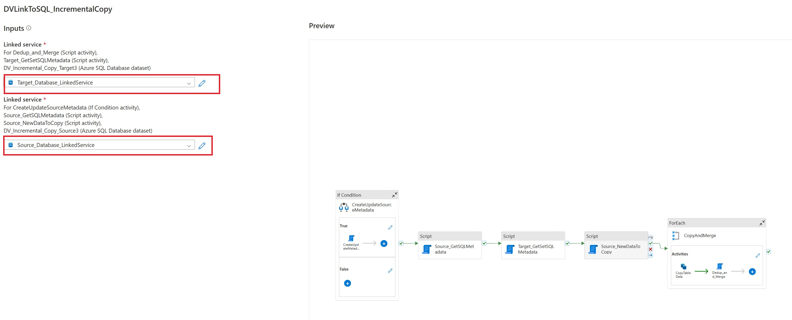

# Overview
There are scenarios where you may need to ingest Dynamics 365 data available in the data lake to relational databases or your existing data warehouse – it can be Azure sql database, synapse dedicated pool or even on-premised sql database. 
This can be integration to existing data warehouse solution or data integration or API scenarios where you expect millisecond response time response from sql server with targeted read.

Following are the two common architecture choices to achieve the objective  

1. Use [Synapse link with delta lake format](https://learn.microsoft.com/en-us/power-apps/maker/data-platform/azure-synapse-link-delta-lake) and then use ETL tool to copy the data to destination database
2. Use [Synapse link with incremental update](https://learn.microsoft.com/en-us/power-apps/maker/data-platform/azure-synapse-incremental-updates) and then use ETL tool to copy the data to destination database

Specially for data integration scenarios following are the key options and considerations 

|Options 				|Description	| Use case   											| Cost factors			 
|-------------------------------	|-----------	|---------------										|---------------------
|Synapse link with delta lake		|Final data in Deltalake format, Lake database on Synapse workspace, ready to query via Synapse serverless or Spark notebook| Incremental data integration + consuming the data directly by variety of tools.. synapse serverless, spark notebook, Microsoft Fabric, Power BI, Databricks etc. | Azure storage account, Synapse spark pool for delta conversion + data pipeline to copy the data |										
|Synapse link with incremental update|Initial and incremental data in timestamp based folder in CSV with metadata in CDM | Incremental data integration | Azure storage account + data pipleine to copy the data |

## Prerequisites
1. Configure Synapse link with appropriate option (Deltalake or Incremental CSV) 
2. Create a Synapse Workspace [Link](https://docs.microsoft.com/en-us/azure/synapse-analytics/quickstart-create-workspace)
3. Create target Azure SQL Database [Link](https://docs.microsoft.com/en-us/azure/azure-sql/database/single-database-create-quickstart?tabs=azure-portal)

## Setup Source database
When using Synapse link with delta lake option, Synapse link create and maintain the metadata for all the tables selected in Synapse Lake database on top of the delta lake data. With incremental update CSV option, Synapse database needs to be manually created and model.json files will be utilized to create and maintain the metadata.  

### Setup Source: Synapse link with delta lake 
1. Run the setup script on the Synapse serverless database created by Synapse link. This will create stored procedure and functions in the database in dvtosql schema. [CreateUpdate_SetupScript](/Analytics/DataverseLink/EDL_To_SynapseLinkDV_DBSetup/Step1_EDL_To_SynapseLinkDV_CreateUpdate_SetupScript.sql)

### Setup Source: Synapse link with incremental CSV 
1. Create a new database in Synapse Serverless SQL pool and master key [CreateSourceDatabaseAndMasterKey](/Analytics/DataverseLink/EDL_To_SynapseLinkDV_DBSetup/Step0_EDL_To_SynapseLinkDV_CreateSourceDatabaseAndMasterKey.sql)
2. Run the setup script on the database created in step 1. This will create stored procedure and functions in the database. [CreateUpdate_SetupScript](/Analytics/DataverseLink/EDL_To_SynapseLinkDV_DBSetup/Step1_EDL_To_SynapseLinkDV_CreateUpdate_SetupScript.sql)

## Setup Target
Depending on your target database, run appropriate script on the target database as described bellow

### Setup Target: Azure SQL Database, SQL Managed instance or SQL Server On-prem database
When using the SQL Server database as destination, run this setup script on the target SQL database, script create the a controltable, stored procedure and functions to faciliate copy and merge data to destination database 
[CreateUpdate_SetupScript](/Analytics/DataverseLink/EDL_To_SynapseLinkDV_DBSetup/Step1_EDL_To_SynapseLinkDV_CreateUpdate_SetupScript.sql)

### Setup Target: Azure Synapse Dedicated Pool
When using Synapse dedicated pool as destination database, run bellow setup script on the target Synapse dedicated pool database. Script create the a controltable, stored procedure and functions to copy and merge data to destination database 
[CreateUpdate_SetupScript_DW](/Analytics/DataverseLink/CloudDataWarehouse_SynapseDW/Step1_EDL_To_SynapseLinkDV_CreateUpdate_SetupScript_DW.sql)

## Setup Synapse Pipeline to copy data to relational database or data warehouse 
To copy Dynamics 365 data available in data lake from Synapse link, to relational database or existing data warehouse solution, you can use ETL tool like ADF, Synapse pipeline, SSIS or other third party tool.Following is a sample generic pipeline template to copy the data using Synapse pipeline.The purpose of this template is to provide a generic open-source solution highlighting the concept that can be further customized and productionize for your use cases. The solution is primarily metadata driven pipeline that uses TSQL scripts/stored-procedures (part of the setup script) to generate metadata, track changes in tables with controltable using high-watermark fields, copy the data to target database and then de-duplicate and merge data to final table in destination.

# Setup the synapse pipeline 

1. Create and publish source and target [parameterized linked service](https://learn.microsoft.com/en-us/azure/data-factory/parameterize-linked-services?tabs=data-factory) of type Azure SQL database (Note: for Synapse dedicated pool or SQL server - solution uses Azure SQL Server type linked services) 

	

2. Download Synapse pipeline template from the following file [Pipeline_DVLinkToSQL_IncrementalCopy](/Analytics/DataverseLink/DataIntegration/DVLinkToSQL_IncrementalCopy.zip)
3. Import the pipeline template from the template downloaded and select the linked services created in step 1.

4. Update and publish changes to the pipeline parameters as per your environment and guidelines bellow 

|Parameter name		|Description  							    | Example	
|-------------------|------------------------------				|---------------										
|SourceDbServer		|Source synapse serverless db server name	|d365analyticssynapse-ondemand.sql.azuresynapse.net
|SourceDbName		|Source synapse serverless db name		    |dataverse_analytics_orgf89b314a
|SourceSchema		|Source schema								|dbo
|TargetDbServer		|Target SQL/Synapse dedicated pool server name|d365-sa-lab-analytics.database.windows.net
|TargetDbName		|Source synapse serverless db name			|D365Data
|TargetSchema		|target schema								|dbo
|StorageDataLocation|Data container location in storage account     |https://d365analyticsincremental.dfs.core.windows.net/dataverse-analytics-orgf89b314a/
|IncrementalCSV     |Is Source synapse link is incremental CSV ? | Source synapse link with incremental update CSV then true; Source synapse link with delta then false
|GenerateSourceMetadata|Want to generate metadata on the source database when pipeline runs ?|  Source synapse link with incremental update CSV then true; Source synapse link with delta then false (as metadta is already created by)

4. Run the pipeline as scheduled trigger 

## Derived tables
One of the known limitations with Synapse Link is derived tables, this is outlined in [Known limitations with finance and operations tables](https://learn.microsoft.com/en-us/power-apps/maker/data-platform/azure-synapse-link-select-fno-data#known-limitations-with-finance-and-operations-tables)
In order to assist in identifying the tables that are required to be exported so that the derived tables can be created correctly there is a SQL script which can be executed on a CHE or a sandbox environment. 
[Get derived tables](/Analytics/DataverseLink/DataIntegration/AdditionalScripts/get_derivetables.sql)

