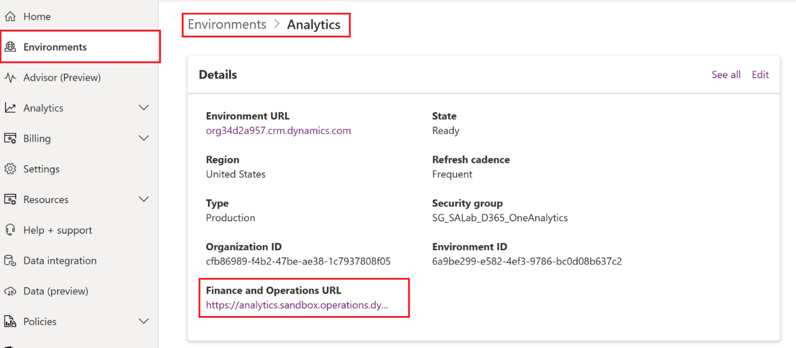
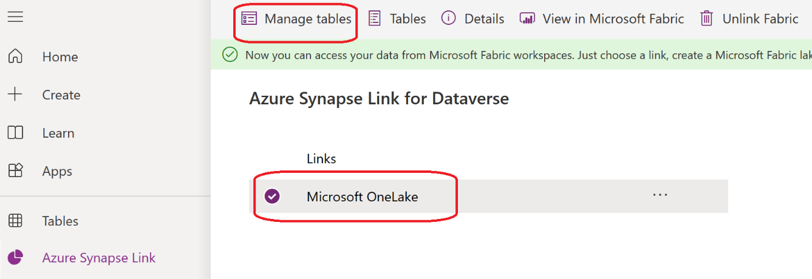
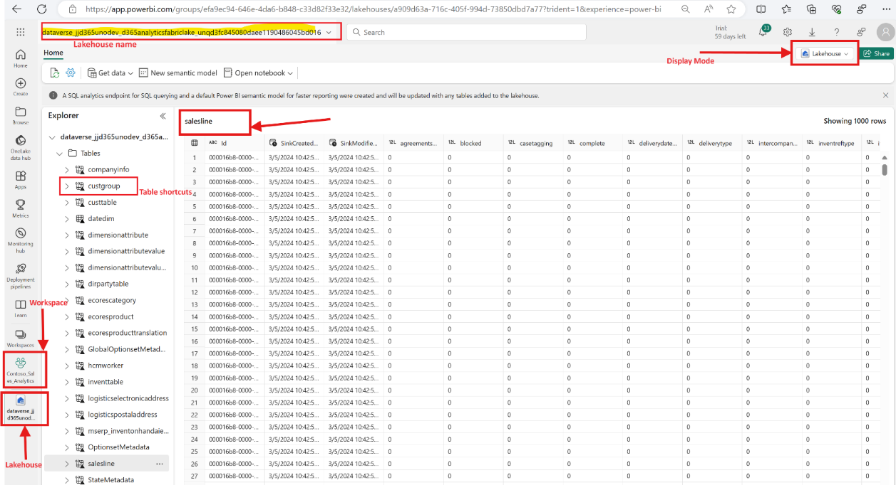
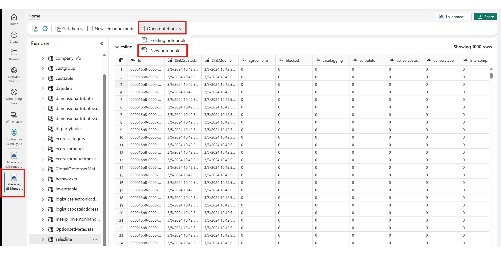
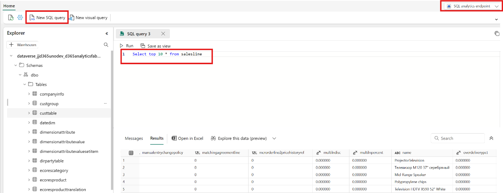
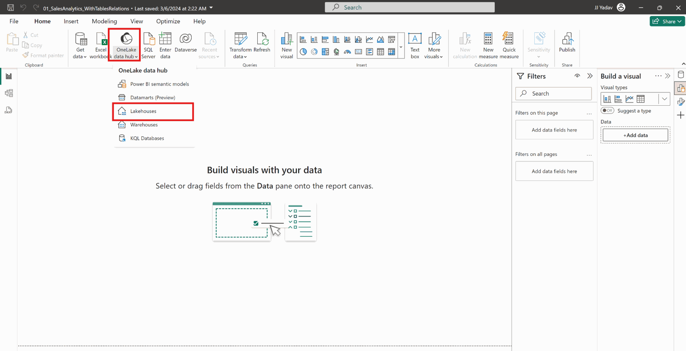

# Hands-on Lab: Link to Fabric from Dynamics 365 finance and operations apps

# Table of Contents
1. [Objective](#objective)
2. [Module 1: Setting up Fabric link with Dynamics 365 finance and operations data](#module-1-setting-up-fabric-link-with-dynamics-365-finance-and-operations-data)
3. [Module 2: Add tables and entities to Microsoft Fabric](#module-2-add-tables-and-entities-to-microsoft-fabric)
4. [Module 3: Explore Dynamics 365 apps data with Microsoft Fabric](#module-3-explore-dynamics-365-apps-data-with-microsoft-fabric.)
5. [Module 4: Creating self-service report using Dynamics 365 data](##module-4-creating-self-service-report-using-dynamics-365-data)
6. [Module 5: Combine Dynamics data with other sources and build Enterprise](#module-5-combine-dynamics-data-with-other-sources-and-build-enterprise-data-warehouse-lakehouse-with-microsoft-fabric)
7. [Module 6: Example using BPA](#module-6-build-app-using-the-fabric-virtual-tables)

# Objective 

Learn how to set up Dataverse Link to Fabric with Dynamics 365 finance and operations apps data and unlock insights using Microsoft Fabric. 

By completing all the modules in this document, you will be able to:

- Configure Fabric link to enable data integration between Dynamics 365 finance and operations apps and other Microsoft services and applications.

- Use Microsoft Fabric to access and analyze finance and operationsapps data.

- Use Lakehouse, SQL Endpoints and Power BI in Fabric to create self-service reports and dashboards based on the finance and operations apps data.

- Work with Data warehouse in Fabric and combine Dynamics 365 finance and operations apps data with data from other sources and build combined reports.

# Module 1: Setting up Fabric link with Dynamics 365 finance and operations data

In this module, you will learn how to set up Fabric link with Dynamics 365 finance and operations apps. This module requires basic knowledge of Dynamics 365 finance and operations apps, Dataverse and Power platform.

1.  Depending on your role and objective, the following table shows different environment options that can be used to set up and use Link to Microsoft Fabric with Dynamics 365 finance and operations apps.

| **Objective**      | **Finance and Operations App environment types** | **Finance and Operations requirements** | **Fabric requirements** |
|--------------------|-----------------------------|------------------------------------|---------------------|
| Individual Learning| Trial Environments <br><br>[Unified admin trials](https://learn.microsoft.com/en-us/power-platform/admin/unified-experience/admin-trials) | Trial license, Access to create Power platform environment | Access to Microsoft Fabric trial or Paid Fabric capacity from Azure |
|                    | Cloud Hosted Development Environment (CHE) <br><br>[Sign up for preview subscriptions](https://learn.microsoft.com/en-us/dynamics365/fin-ops-core/dev-itpro/dev-tools/sign-up-preview-subscription#subscribe)  <br><br>[Access development environments](https://learn.microsoft.com/en-us/dynamics365/fin-ops-core/dev-itpro/dev-tools/access-instances)  | LCS Prospect projects and Azure subscription to deploy CHE environments <br><br>Power Platform Integration can only be set up at deployment time. | |
| Customer/Partner Organization with Dynamics 365 Finance and Operations Apps License | Unified development environments <br><br>[Unified experience for finance and operations apps](https://learn.microsoft.com/en-us/power-platform/developer/unified-experience/finance-operations-dev-overview) | Administrator access to Power platform environment | |
|| Sandbox (tier 2+) or Production Environments | Administrator access to Power platform environment | |


2.  Create a new, or use an existing, Dynamics 365 finance and operations apps environment **Integrated with Power Platform** as one of the options described in the table above.

3.  Login to Power Platform Admin center (<https://admin.powerplatform.microsoft.com/environments>) and select the environment connected to the Dynamics 365 finance and operations apps environment.
 
>*Tip: The name of the Power platform environment usually matches the name of the Dynamics 365 finance and operations apps environment. To learn more about how to use Dynamics 365 finance and operations apps with Power platform, follow this link: [Enable Power Platform Integration - Finance & Operations \| Dynamics 365 \| Microsoft Learn](https://learn.microsoft.com/en-us/dynamics365/fin-ops-core/dev-itpro/power-platform/enable-power-platform-integration)*
 
 If you can\'t view the power platform environment, you might not have System Administrator access to the environment. You can contact the system administrator and ask them to give you the system administrator role as a user in the power platform environment. [Add users to an environment automatically or manually - Power Platform \| Microsoft Learn](https://learn.microsoft.com/en-us/power-platform/admin/add-users-to-environment#add-users-to-an-environment-that-has-a-dataverse-database)
 
<!-- {width="6.561986001749781in" height="1.6367541557305336in"} -->

To check if a Power Platform Environment has a connection to a Dynamics 365 finance and operations app:

-   Select the Power platform environment.

-   Under Details tab, validate the **Finance and Operations URL** is populated.



4.  Click on the **Finance and Operations URL** to login and validate the application and platform versions meet the minimum version requirements. **Help & Support** \> **About**


5.  Ensure the Dynamics 365 finance and operations app environment has the **License configuration** key **Sql row version change tracking** enabled.

    a.  Navigate to **System administration** \> **Setup** \> **License configuration**.

    b.  Validate that **Sql row version change tracking** is enabled as shown in the image below.
 

 >*From platform update 63 / application update 10.0.39, sql row version change tracking is on by default.*

```{=html}
If the configuration key is turned off, take the following steps to turn on the license configuration key.

i.  Follow the documentation to turn on maintenance mode for the Dynamics 365 finance and operations app environment [Maintenance mode - Finance & Operations](https://learn.microsoft.com/en-us/dynamics365/fin-ops-core/dev-itpro/sysadmin/maintenance-mode).

ii. Login to the Dynamics 365 finance and operations app using the environment URL.

iii. Navigate to **System administration** \> **Setup** \> **License** **configuration**.

iv. Select the check box **Sql row version change tracking** and click save.

v.  Exit maintenance mode following the above documentation in step 1.

```
6.  Setup Dataverse Link to Microsoft Fabric

    i.  Login to <https://make.powerapps.com/> and select the environment.

    ii. Select **Tables** \> **Analyze** \> **Link to Microsoft Fabric.**

    iii. Login to **Create connection.**

    iv. Select **Fabric Workspace.**

    v.  Click **Create** to complete the shortcut creation and initial sync.


> To learn more, follow the documentation at [Link to Microsoft Fabric](https://learn.microsoft.com/en-us/power-apps/maker/data-platform/azure-synapse-link-view-in-fabric#link-to-microsoft-fabric)

# Module 2: Add tables and entities to Microsoft Fabric 

Understanding Finance and Operations Tables and Data Entities and what to use

The table below compares the relevant features of Dynamics 365 finance and operations apps tables and entities, which are both supported by Fabric link. Tables are database objects that store data in rows and columns, while entities are abstractions that combine data from multiple tables and provide a common interface for querying and manipulating data. The table lists the pros and cons of using each option with Fabric.

|              | **Description**    | **Pros**   | **Cons**          | **Recommendation**  |
|--------------|--------------------|------------|-------------------|---------------------|
| Tables       | Tables are normalized ERP tables | Easy access to data | To create dimensional data models, you need to join tables in Microsoft Fabric and other tools. | Utilize entities where applicable. Use tables to gain easy access to data and create your own data model as necessary by joining relevant tables. |
| Data Entities | Data entities are denormalized data models consisting of one or more tables | Many of the OOB entities e.g., CustCustomerV3Entity, are complex and don't support row version change tracking and hence are not available in synapse link. Entities are development-dependent and design time schemas, which means adding new columns requires development and a code release. | Entities are development-dependent and design time schemas, which means adding new columns requires development and a code release. ||

 1. Now that you have setup Link to Microsoft Fabric, lets add your Dynamics 365 finance and operations apps data using [Manage link to Fabric.](https://learn.microsoft.com/en-us/power-apps/maker/data-platform/azure-synapse-link-view-in-fabric#manage-link-to-fabric)

    a.  In the power platform maker portal (<https://make.powerapps.com/>), select your environment, navigate to **Azure Synapse link**, select **Microsoft OneLake**, and then click **Manage tables.** 
    
    b.  To add a finance and operations **table**, click on the **D365 Finance and Operations** tab, then search by table name, for example "salesline", then select the table on the grid, and click **Save.**
    
    c.  To add a finance and operations **data entity**, click on the **Dataverse** tab and then search for "mserp\_", select the entity, and save.
    
    d.  On the Synapse link profile page, you will be able to monitor the sync process. Click on **Refresh Fabric tables** to update the Fabric metadata for newly added tables. Note that the initial sync may take some time.


> *Note: You can enable both finance and operations entities and tables in Azure Synapse Link for Dataverse. The process of enabling additional finance and operations entities is detailed at* [Choose finance and operations data in Azure Synapse Link for Dataverse - Power Apps \| Microsoft Learn](https://learn.microsoft.com/en-us/power-apps/maker/data-platform/azure-synapse-link-select-fno-data#enable-finance-and-operations-data-entities-in-azure-synapse-link)

Now that the table and entities are added to Microsoft Fabric, let us explore the data using Microsoft Fabric in the next section.

>*Note: Depending on the data, the initial sync of the data can take a while and the Tables in Fabric link may show as if the data export is not complete.*

# Module 3: Explore Dynamics 365 apps data with Microsoft Fabric. 

In this section, you will learn how to add tables and entities from Dataverse to Microsoft Fabric Link, which enables you to access and analyze your Dynamics 365 apps data with Microsoft Fabric. You will also learn how to navigate to the Fabric workspace from Dataverse and explore your data using the Microsoft Fabric Lakehouse platform.

1.  **Explore data using Microsoft Fabric Lakehouse:** After you connect Dataverse to Microsoft Fabric Link, you can go to Fabric workspace by following these steps.

    a.  Select **Tables** \> **Analyze** \> **Link to Microsoft Fabric**
      
    b.  Another option is to click **Azure Synapse Link**, choose **Microsoft OneLake** and then click on the **View in Microsoft Fabric** button as shown below.
      

2.  Dataverse linked to Fabric Lakehouse will open in a new browser tab. To learn more, follow the Microsoft Fabric documentation at [What is a lakehouse? - Microsoft Fabric](https://learn.microsoft.com/en-us/fabric/data-engineering/lakehouse-overview). The screenshot below highlights the following elements:

    i.  Fabric Workspace: As selected during setup of Link to Microsoft         Fabric

    ii. Fabric Lakehouse: Automatically generated based on your environment name -- cannot be changed.

    iii. Shortcuts created for each table selected (small link icon represents the shortcut)

    iv. Sample top 1000 rows loaded for selected table.

    v.  Expand the table to see the column's information for a table.



3.  Explore data using Spark notebooks.

    a.  In Lakehouse mode, click on the **Open notebook** and click on **New notebook**.

    b.  Rename the notebook.

    c.  Expand the Lakehouse explorer and select the table salesline.

    d.  Click on the ... and select content menu Load data \> Spark. A code cell is added to the Spark notebook with pyspark code to select top 1000 lines of selected table.

    e.  Click the Play button to execute the notebook cell to execute the query. The spark session is started, and result is displayed on the grid.

    f.  You can do a lot with this Spark notebook to explore the data. Notice other options on the notebook cell output grid such as **Chart** and **Inspect** button, try them out.



4.  Explore data using T-SQL

    a.  From your lakehouse, click on the top right corner and switch from **Lakehouse** to **SQL analytics endpoint** to visualize data using T-SQL. To learn more, follow the documentation page [What is the SQL analytics endpoint for a lakehouse?](https://learn.microsoft.com/en-us/fabric/data-engineering/lakehouse-sql-analytics-endpoint)

    b.  SQL analytics endpoint view lets you visualize table metadata and write and execute T-SQL queries in the browser as shown below.



c.  Click on the gear icon and copy the SQL connection string to connect to SQL endpoint with Microsoft Entra ID credentials using the SSMS or your favorite client to query the data using TSQL and create views, stored procedures, functions etc.
  

5.  Explore data using visual query.

    a.  Click on New visual query

    b.  Drag table salesline to canvas

    c.  Click on Manage columns\>Choose columns and select relevant columns.

    d.  Click on the + sign on the canvas and select and Group by transformation.

    e.  Select the group by column dataareaid and count, data is summarized and displays

    f.  Click on visualize result -- to open power BI interface to create report visual save report

    g.  Click on download Excel file to download summarized data


6.  Explore data using Power BI (using semantic models)

    a.  Using Power BI service at <https://app.powerbi.com>, you can easily open the report you saved in 4f above, and create a new report using the semantic model from the report in 4f, or from your lakehouse (Create \> Pick a semantic model)

    b.  Using Power BI Desktop, you can do the same thing via New \> Get Data \> Power BI semantic models

# Module 4: Creating self-service report using Dynamics 365 data

This module will teach us how to create self-service reports with Dynamics 365 data. ERP and CRM data models are complicated and can have hundreds of tables and lots of columns in each table. This complexity makes it difficult for non-technical business users or analysts to analyze data and create reports. In these steps we will learn how to make simplified data models for business users and build self-service reports using the data model.

1.  Add the following Finance and Operations tables to Fabric link and refresh Fabric tables.

| **Table name**                   | **Description**           | **Use case**           |
|----------------------------------|---------------------------|------------------------|
| Companyinfo                      | Table that holds legal entity list and party link | |
| Dirpartytable                    | Holds customer, vendor, employee name and other information | |
| logisticspostaladdress           | Postal address information for party and transactions | |
| logisticselectronicaddress       | Electronic address such as phone, email address for party and transactions | |
| Custtable                        | Customer table | |
| Custgroup                        | Customer group/segmentation | |
| Hcmworker                        | Employee master record | |
| Vendtable                        | Supplier master table | |
| inventtable                      | Released product master table | |
| ecoresproduct                    | Product master table | |
| ecoresproducttranslation         | Product name and translation | |
| Salesline                        | Sales order line details | |
| dimensionattributevaluesetitem <br /> Dimensionattributevalue <br /> Dimensionattribute| Financial dimension attribute information | Utilized to define additional segments for customer, supplier, product, and other dimensions for financial reporting |


2.  Create a Data flow gen 2 to load date dimension to Lakehouse.

    a.  Open the Lakehouse and click on Get Data \> Create New Dataflow Gen 2

    b.  Give a name to Dataflow.

    c.  To make it easier, we can import a template that already has steps to create our datedim and load to our lakehouse. Locate the template and import by clicking Import from a Power Query template.

    d.  Click on the advance editor and analyze the code. If you are not familiar with Dataflows note that they use M query as the language to define steps. Don't know M query? No worries, you can design Dataflow steps visually or using natural language with Copilot!

    e.  Publish the data flow. It will start running and when completed, you will get a notification on notifications icon.

    f.  Open the Lakehouse and find the datedim table that was created and loaded with the Dataflow.


3.  Create self-service views using the SQL endpoint.

    a.  Connect to SQL endpoint.

    b.  Download and open the dimandfacts.sql views in the SQL server management studio or any other SQL editor

    c.  Spend some time reading the script and comment section to understand the scripts.

[This script](./dimandfacts.sql) is to help create a simple dimensional data model on Dynamics 365 for Finance and Operations tables enabled via Fabric link

Script creates following views that are intended to be used in the final Semantic data model and Power BI report.

1.\[dbo\].\[customers\]

2.\[dbo\].\[legalentity\]

3.\[dbo\].\[products\]

4.\[dbo\].\[empoyees\]

5.\[dbo\].\[vendors\]

6.\[dbo\].\[salesorderdetails\]

Two additional views and function are created by script as generic templates and used in the views above

\[dbo\].\[defaultfinancialdimension_view\]

\[dbo\].\[dirpartyprimary_view\]

Table-Valued Functions: \[dbo\].\[GetEnumTranslations\]

d.  Execute the script and validate the views are created

```{=html}
<!-- -->
```
4.  Use Power BI Desktop to connect to views and create Semantic model

```{=html}
<!-- -->
```
a)  Open Power BI desktop and connect to OneLake data hub, select the Lakehouse and connect to SQL endpoint

b)  Select the following views.

  |Name|Type|Description|
  |----|----|-----------|
  |customers|Dimension|Customer dimension with customer id, name and address and business segmentation|
  |Legalentity|Dimension|Legal entities dimension|
  |Products|Dimension|Product dimension with product id, name|
  |Datedim|Dimension|Date dimension|
  |Salesorderdetails|Fact|Sales order details fact|
   

c)  Build relationship between tables using the following details.

  
  |Name|Type|Description|
  |----|----|-----------|
  |customers.customerid|Salesorderdetails.customerid|1 to many|
  |legalentity.legalentityid|Salesorderdetails.legalentityid|1 to many|
  |products.productid|Salesorderdetails.productid|1 to many|
  |datedim.date|Salesorderdetails.Order date|1 to many|


d)  Create a few basic measures on the salesorderdetails table as outlined in this table
 
  |Name|DAX code|
  |----|---------|
  |Sales order count|Sales order count = DISTINCTCOUNT(salesorderdetails\[Order Id\])|
  |Sales amount|Sales amount = Sum(salesorderdetails\[Line Amount\])|
  |Back order days|Back order days = DATEDIFF(TODAY(),FIRSTDATE(salesorderdetails\[Order Date\]),DAY)|


<!-- {width="5.90625in" height="3.0297331583552056in"} -->

e)  Build Power BI visuals

5. Publish to Power BI report to Microsoft Fabric workspace

# Module 5: Combine Dynamics data with other sources and build Enterprise data warehouse, Lakehouse with Microsoft Fabric

In this module we will explore bringing data from other sources to Microsoft Onelake and then transform and combine the data with Dynamics 365 data to build Power BI reports.

In the following example, we are bringing Dynamics AX 2012 data that is on-premises to Microsoft one lake.

**Load data from On-prem SQL Server to Lakehouse**

1.  Follow the documentation to install on-prem data gateway and create connection to AX 2012 database [How to access on-premises data sources in Data Factory - Microsoft Fabric \| Microsoft Learn](https://learn.microsoft.com/en-us/fabric/data-factory/how-to-access-on-premises-data)

2.  Open Microsoft Fabric workspace and create a Lakehouse -- lets name it **Legacy_AX_2012_Data**

3.  Click on **Get data in your lakehouse \>New Dataflow Gen 2** to create a new dataflow to load data.

4.  Rename Dataflow to Load_AX2012_Data_Lakehouse and click on **Import from Power query template**

5.  Locate Load_AX2012_Data_Lakehouse.pqt and click **Open** on the file explorer to load the template. This template have predefined list of tables from Dynamics AX 2012 database.

6.  Select the parameters SourceDBServer and SourceDBName and change the value as per your environment Database server name and Database name.

7.  Click on **Configure connection** and select the connection created in step 1.

8.  Connection with the database server and database will be established and preview data will be loaded in Power Query.

9.  Select a Table and click on **+ button Data Destination** and select **Lakehouse**

10. Create or select a connection to Lakehouse

11. Select Workspace name and destination Lakehouse created in step 2 **Legacy_AX_2012_Data** and keep the TableName as populated default and click **Next**

12. On the Destination setting tabs select the **Use automatic settings** and click **Save settings**

13. **Repeat** steps 9-12 for each tables.

14. When all tables destination are mapped, click on the Publish button to publish the Dataflow Gen2

15. Publishing will finish and Dataflow will execute to load the data in the Lakehouse. Right click on the Dataflow and **Refresh history** to validate the refresh history and result.

16. Open the Lakehouse and you will notice all the tables are loaded in the Lakehouse

**Transform legacy data for self-service reporting.**

Now that we have loaded the Dynamics AX 2012 legacy data to Lakehouse, lets create some views on top of these tables to create self-service reporting data model.

1.  Create self-service views using the SQL endpoint.

    a.  Connect to SQL endpoint.

    b.  Download and open the **ax2012_dimandfacts.sql** views in the SQL server management studio or any other SQL editor

    c.  Spend some time reading the scripts,

> You might see that the script used is very close to Dynamics 365 self-service reporting table. Most of the schema and join are alike, this is because Dynamics 365 came from on-premises Dynamics AX. This means customers who are switching from on-premises software and know the schema and data model or have already built data warehouse can use their solution with little effort and apply similar model on D365 data.

**Combine Dynamics 365 and legacy data.**

1.  Create a Datawarehouse

2.  Connect to SQL Endpoint

3.  Run the gold_dimandfacts_materialize.sql

4.  Spend some time reading the script

5.  Create a pipeline to execute the stored procedure

6.  Configure schedule for the pipeline

**Build Power BI Report using the direct lake**

# Module 6: Build App using the Fabric Virtual Tables

Coming soon!