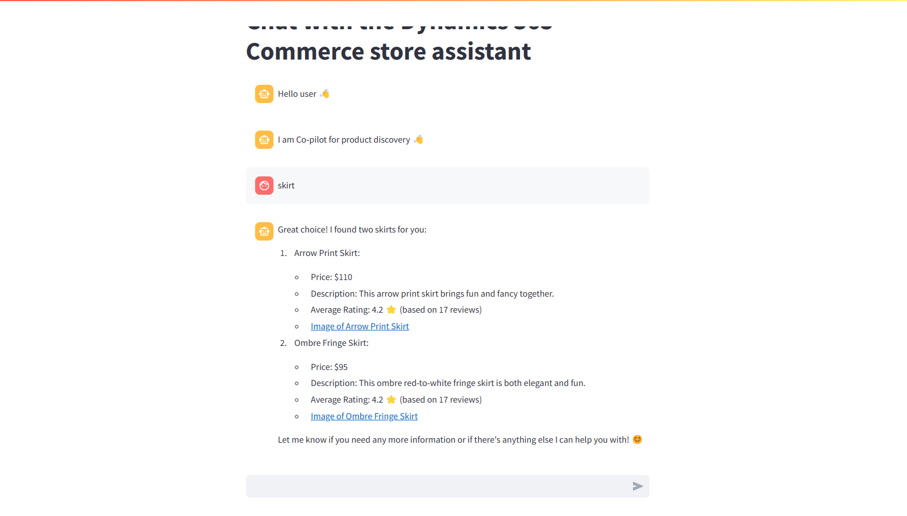

### NOTE

> The code is shared under the sample code notice

# Create a sample product discovery AI chat assistant app using Azure Open AI service and Dynamics 365 Commerce

Product discovery sample app. The app responds to product inquiries in natural language using CSU APIs and Fabric SQL endpoint.

The app uses AI [function calling](https://learn.microsoft.com/en-us/azure/ai-services/openai/how-to/function-calling?tabs=python) to fetch data from CSU and Fabric based on the prompt and responds in natural language.

- Reads product data from CSU
- Reads product data from Fabric SQL endpoint
- Uses Open API chat completion
- Responds in natural text

# Pre-requisites

1. An Azure subscription - [Create one for free](https://azure.microsoft.com/en-us/free/ai-services/)
2. Access granted to Azure OpenAI in the desired Azure subscription
3. [Python 3.8 or later version](https://www.python.org/).If you're using a Linux client machine, see Install the ODBC driver.
4. An Azure OpenAI Service resource with a gpt-35-turbo(0613) model deployed. For more information about model deployment, see the [resource deployment guide](https://learn.microsoft.com/en-us/azure/ai-services/openai/how-to/create-resource?pivots=web-portal).
5. Install Conda [Installing on Windows — conda 24.5.1.dev19 documentation](https://conda.io/projects/conda/en/latest/user-guide/install/windows.html)
6. [Link to fabric](https://learn.microsoft.com/en-us/power-apps/maker/data-platform/azure-synapse-link-view-in-fabric)
7. Visual Studio Code with the Python extension

# Setup

1. Update the env file with resource details(CSU, OPENAI, Fabric SQL Endpoint)
2. Run `conda env create -f environment.yml`
3. To get details of environment `conda info --envs`.
4. Run `conda activate OpenAISampleApp`
5. Select the OpenAISampleApp env python interpreter in VS code.
6. Install all the packages with `conda env update --file environment.yml --prune`
7. Create view variantinfoview in Fabric using SQL endpoint.
8. Hit F5 to run.

# Resources

- [Function calling open AI](https://platform.openai.com/docs/guides/function-calling)
- [SQL analytics endpoint for a Lakehouse](https://learn.microsoft.com/en-us/fabric/data-engineering/lakehouse-sql-analytics-endpoint)
- [Rapid prototyping with Streamlit](https://streamlit.io/)
- [Connect to and query Azure SQL Database using Python and the pyodbc driver](https://learn.microsoft.com/en-us/azure/azure-sql/database/azure-sql-python-quickstart?view=azuresql&tabs=windows%2Csql-inter)
- [Conda](https://docs.conda.io/en/latest/)

## Contributing

This project welcomes contributions and suggestions. Most contributions require you to agree to a
Contributor License Agreement (CLA) declaring that you have the right to, and actually do, grant us
the rights to use your contribution. For details, visit https://cla.opensource.microsoft.com.

When you submit a pull request, a CLA bot will automatically determine whether you need to provide
a CLA and decorate the PR appropriately (e.g., status check, comment). Simply follow the instructions
provided by the bot. You will only need to do this once across all repos using our CLA.

This project has adopted the [Microsoft Open Source Code of Conduct](https://opensource.microsoft.com/codeofconduct/).
For more information see the [Code of Conduct FAQ](https://opensource.microsoft.com/codeofconduct/faq/) or
contact [opencode@microsoft.com](mailto:opencode@microsoft.com) with any additional questions or comments.
