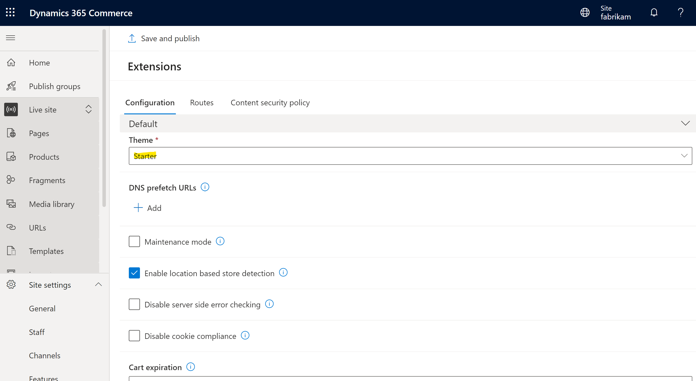

# Dynamics 365 Commerce storefront E2E functional test sample

## Introduction

This is a sample project on how to automate functional end to end tests for Dynamics 365 Commerce storefront .

### Automated end to end checkout functional test


### Pre-requisites

1. Node.js to be installed with a version 16.0.0 or later - Download | Node.js (nodejs.org)
2. Visual studio code can be installed from Download Visual Studio Code - Mac, Linux, Windows
3. GIT must be installed http://git-scm.com/download/win
4. Yarn must be installed Installation | Yarn - Package Manager (yarnpkg.com)
5. This sample uses starter theme and test payment connector for card payment.Change the theme in site builder to user starter theme.Change the payment connector configuration to use test connector.
   
   

### Setup

1. Open PowerShell as administrator and type ‘code’.Visual Studio Code will open.
2. Clone Ecommerce E2E from github using git or visual studio code
3. In VS Code Go to “Terminal” and then click “New Terminal”
4. In the VS Code Terminal type the command `yarn install`

    Troubleshoot:  
    If the command is not recognized although using a Node.js version 16.0.0 or later you can use “npm i -g corepack” from the VS Code Terminal command line to modify

5. Once yarn install has finished successfully, type `yarn start` in the VS Code Terminal
6. The test will start(ecommerce site will open…) in edge browser in incognito mode

### Configuration

Adjust test speed from value 0.1(lowest)-1(highest) in config.testcaferc

```
"speed": 0.1
```

### Integration

1. [Emulating the test on specific device or screen size](https://testcafe.io/documentation/402828/guides/concepts/browsers#emulate-a-device)
2. [Running the tests as part of devops pipeline](https://testcafe.io/documentation/402822/guides/continuous-integration/azure-devops)
3. [Cross browser testing](https://testcafe.io/documentation/402828/guides/concepts/browsers)

### Troubleshoot
If the test doesn’t start (eCommerce site is not showing) review the VS Code Terminal command output.
The test script is configured to use edge in incognito mode.  
To validate installed browsers you can use yarn list-browsers  
If the command is not recognized, run another install of testcafe using npm install -g testcafe
If you need to use a different browser you can change the config-file config.testcaferc.json

## Contributing

This project welcomes contributions and suggestions. Most contributions require you to agree to a
Contributor License Agreement (CLA) declaring that you have the right to, and actually do, grant us
the rights to use your contribution. For details, visit https://cla.opensource.microsoft.com.

When you submit a pull request, a CLA bot will automatically determine whether you need to provide
a CLA and decorate the PR appropriately (e.g., status check, comment). Simply follow the instructions
provided by the bot. You will only need to do this once across all repos using our CLA.

This project has adopted the [Microsoft Open Source Code of Conduct](https://opensource.microsoft.com/codeofconduct/).
For more information see the [Code of Conduct FAQ](https://opensource.microsoft.com/codeofconduct/faq/) or
contact [opencode@microsoft.com](mailto:opencode@microsoft.com) with any additional questions or comments.
